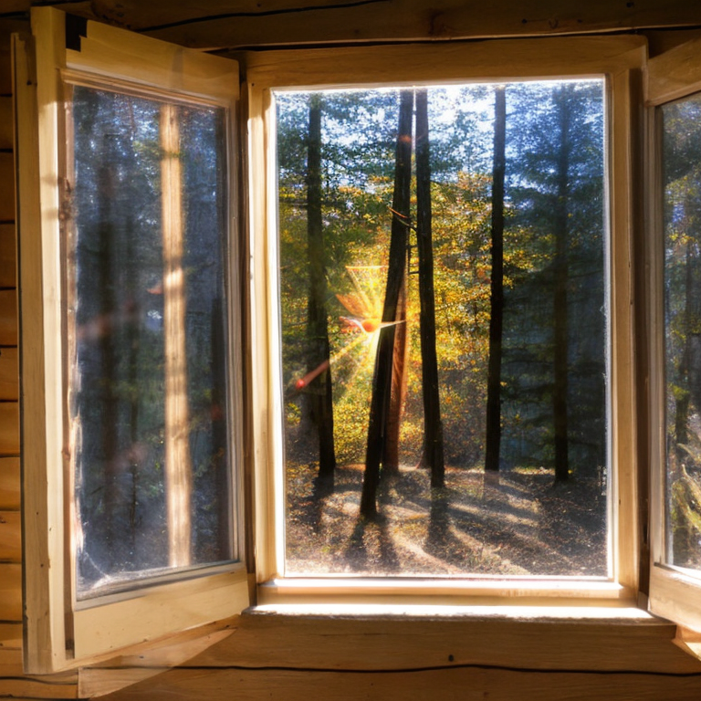
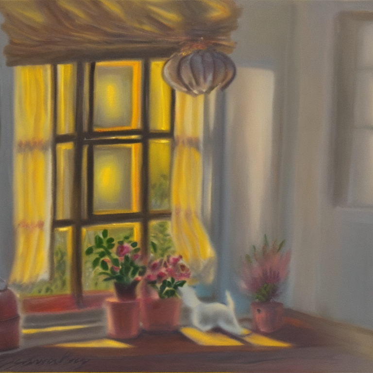

## **LLM+stable diffusion-v2**
本项目基于给定的环境形容词（keywords），拼接随机的绘画主人公，利用Qwen 1.5-1.8B随机生成相关的场景文字，进一步拼接随机的绘画风格，输入stable-diffusion-v2模型批量生成不同的图片

完成环境配置与模型下载后，你只需要指定keywords，主人公，绘画风格便可批量生成相关图片。

## **Environment setup**

My device：Linux，PyTorch version 2.1.2+cu121

**1. 首先，请安装相关依赖**
```shell
pip install modelspace
pip install -r requirement.txt
```
**2.  请下载Qwen与stable-diffusion-v2**
```shell
python download.py
```
耗时较久！可能存在下来模型的文件名不一致，请进行对模型文件夹名称或者generate_img.py里面的模型路径名称进行修改。

**3. 生成图片**
在generate_img.py中修改你想要修改的参数，然后在终端直接运行
```
python generate_img.py
```


